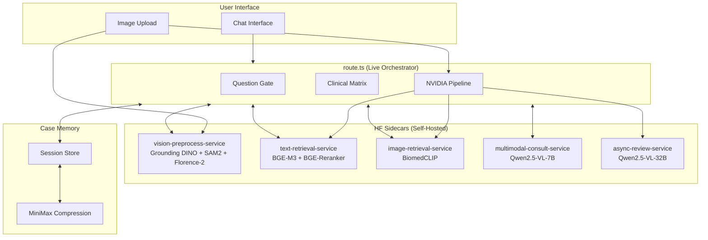

# PawVital Veterinary Symptom Analyzer: World-Class Build Plan

## Architecture Decisions (Final)

### Service Boundary Decisions

| Service | Models | Latency Target | Scaling | Failure Mode |
|---------|--------|----------------|---------|--------------|
| `vision-preprocess-service` | Grounding DINO, SAM2.1, Florence-2 | p95 < 2s | GPU, per-request | Degrade to current NVIDIA path |
| `text-retrieval-service` | BGE-M3, BGE-Reranker-v2-M3 | p95 < 1s | CPU/memory | Skip RAG, use matrix only |
| `image-retrieval-service` | BiomedCLIP | p95 < 1.5s | GPU | Skip image RAG, continue |
| `multimodal-consult-service` | Qwen2.5-VL-7B-Instruct | p95 < 5s | GPU | Skip consult, use NVIDIA |
| `async-review-service` | Qwen2.5-VL-32B-Instruct | Batch job | GPU | Non-blocking, best-effort |

**Rationale:**
- **4 services** instead of 3 because text retrieval and image retrieval have different hardware profiles
- **Qwen 32B as async batch** - Complex review should not block live traffic; it queues for background processing
- **Florence-2 stays in vision-preprocess** - It's always needed with the other two for region understanding
- **BiomedCLIP isolated** - Image similarity search has different corpus (dog images) and GPU needs

---

## System Architecture



---

## Image Flow (v1 Scope: wound/skin + eye + ear + stool/vomit)

### Step-by-Step Flow

```
User Upload Image
       │
       ▼
┌─────────────────┐
│ vision-preprocess│
│ service         │
│ (DINO + SAM +   │
│  Florence-2)    │
└────────┬────────┘
         │
         ▼
┌─────────────────────────────────┐
│ VisionPreprocessResult:         │
│ - domain: skin_wound | eye |    │
│   ear | stool_vomit            │
│ - body_region                   │
│ - detected_regions[]            │
│ - best_crop (base64)           │
│ - image_quality                │
│ - confidence                   │
│ - limitations                  │
└────────┬────────────────────────┘
         │
         ▼
┌─────────────────────────────────┐
│ Escalation Decision:            │
│                                 │
│ Tier 2 if:                     │
│   - confidence < 0.75           │
│   - severity needs_review/urgent│
│   - multiple lesions           │
│   - text conflicts visual       │
│   - borderline quality          │
│                                 │
│ Qwen VL consult if:            │
│   - Tier 2 confidence < 0.70   │
│   - severe/urgent + ambiguous   │
│   - conflict: text vs vision    │
│   - eye/ear/stool moderate+     │
└────────┬────────────────────────┘
         │
         ▼
┌─────────────────────────────────┐
│ NVIDIA Vision (Tier 1 → 2 → 3) │
│ + original image                │
│ + best_crop                     │
│ + domain + body_region context  │
└────────┬────────────────────────┘
         │
         ▼
   ... continue to extraction/diagnosis ...
```

---

## Key Interfaces

### VisionPreprocessResult
```typescript
interface VisionPreprocessResult {
  domain: "skin_wound" | "eye" | "ear" | "stool_vomit" | "unsupported";
  bodyRegion: string;
  detectedRegions: Array<{
    regionId: string;
    boundingBox: { x: number; y: number; width: number; height: number };
    label: string;
    confidence: number;
  }>;
  bestCrop: string; // base64
  imageQuality: "excellent" | "good" | "acceptable" | "poor";
  confidence: number; // 0-1
  limitations: string[]; // ["motion_blur", "partial_visibility", etc.]
}
```

### VisionClinicalEvidence
```typescript
interface VisionClinicalEvidence {
  findings: Array<{
    description: string;
    severity: "normal" | "needs_review" | "urgent";
    supportedSymptoms: string[];
    bodyRegion: string;
  }>;
  severity: "normal" | "needs_review" | "urgent";
  confidence: number; // 0-1
  contradictions: string[]; // conflicts with owner text
  requiresConsult: boolean;
  consultReason?: string;
}
```

### ConsultOpinion
```typescript
interface ConsultOpinion {
  model: "Qwen2.5-VL-7B" | "Qwen2.5-VL-32B";
  summary: string;
  agreements: string[]; // agrees with NVIDIA findings
  disagreements: string[]; // contradicts NVIDIA findings
  uncertainties: string[]; // things the model is unsure about
  confidence: number; // 0-1
  mode: "sync" | "async";
}
```

### RetrievalBundle
```typescript
interface RetrievalBundle {
  textChunks: Array<{
    chunkId: string;
    textContent: string;
    sourceTitle: string;
    citation: string;
    relevanceScore: number;
  }>;
  imageMatches: Array<{
    assetId: string;
    conditionLabel: string;
    localPath: string;
    similarity: number;
    caption: string;
  }>;
  rerankScores: Record<string, number>; // chunkId -> rerank score
  sourceCitations: string[];
}
```

### CaseMemoryV2 (Extended)
```typescript
interface CaseMemoryV2 {
  // Existing fields
  turn_count: number;
  chief_complaints: string[];
  active_focus_symptoms: string[];
  confirmed_facts: Record<string, string | boolean | number>;
  
  // New fields
  visualEvidence: Array<{
    turn: number;
    domain: string;
    bodyRegion: string;
    finding: string;
    severity: string;
    confidence: number;
    influencedQuestion: boolean;
    imageQuality: string;
  }>;
  retrievalEvidence: Array<{
    turn: number;
    textChunksUsed: string[];
    imageMatchesUsed: string[];
    sourceCitations: string[];
  }>;
  consultOpinions: ConsultOpinion[];
  evidenceChain: Array<{
    source: string;
    finding: string;
    supporting: string[];
    contradicting: string[];
    confidence: number;
  }>;
  ambiguityFlags: string[];
  serviceTimeouts: Array<{
    service: string;
    turn: number;
    fallbackUsed: string;
  }>;
}
```

---

## Escalation Thresholds

### Tier 2 Escalation (NVIDIA Internal)
| Condition | Threshold | Rationale |
|-----------|-----------|-----------|
| Tier 1 confidence | < 0.75 | Below this, classification is unreliable |
| Severity classification | needs_review or urgent | Automatic escalation |
| Multiple lesions | > 1 detected region | Complexity requires deeper analysis |
| Text-visual conflict | Any mismatch | Must resolve contradiction |
| Image quality | borderline | May affect accuracy |

### Qwen VL Synchronous Consult
| Condition | Threshold | Rationale |
|-----------|-----------|-----------|
| Tier 2 confidence | < 0.70 | High uncertainty |
| Severe visual + ambiguity | Any | Risk of missed diagnosis |
| Owner text vs vision conflict | Detected | Must adjudicate |
| Eye/Ear/Stool severity | moderate+ with unclear morphology | Domain-specific difficulty |

### Qwen VL Async Review (Non-Blocking)
| Condition | Threshold | Rationale |
|-----------|-----------|-----------|
| Post-report ambiguity | unresolved after first pass | Continuous improvement |
| Complex multi-symptom | > 3 symptoms | High diagnostic difficulty |
| Low retrieval confidence | top match < 0.6 | Weak RAG support |

---

## Performance Targets

| Path | p95 Latency | Notes |
|------|-------------|-------|
| Image turn (NVIDIA only, no consult) | <= 10s | Pre-vision + NVIDIA vision |
| Image turn (NVIDIA + Qwen sync consult) | <= 15s | Adds ~5s for Qwen 7B |
| Text-only turn | <= 3s | No vision processing |
| Report generation with RAG | <= 5s | Retrieval adds overhead |

**Timeout Behavior:**
- vision-preprocess: 8s timeout → continue with original image
- text-retrieval: 5s timeout → skip text RAG
- image-retrieval: 5s timeout → skip image RAG
- Qwen consult: 10s timeout → skip consult, use NVIDIA only
- All timeouts logged to `serviceTimeouts[]` in case memory

---

## Implementation Phases

### Phase 1: Vision Preprocessing (Weeks 1-2)
**Goal:** Enable precise lesion localization and domain classification

**Files to create:**
- `src/lib/vision-preprocess.ts` - Client for vision-preprocess-service
- `src/lib/vision-domains.ts` - Domain classification logic
- `src/types/vision-preprocess.ts` - TypeScript interfaces

**Files to modify:**
- `route.ts` - Add pre-vision step before NVIDIA vision pipeline
- `nvidia-models.ts` - Pass best_crop and domain context to Tier 1

**Environment variables:**
```bash
VISION_PREPROCESS_URL=http://localhost:8080
VISION_PREPROCESS_API_KEY=your-api-key
```

### Phase 2: Retrieval Enhancement (Weeks 3-4)
**Goal:** Improve RAG quality with BGE-M3 and BiomedCLIP

**Files to create:**
- `src/lib/text-retrieval-service.ts` - Client for text-retrieval-service
- `src/lib/image-retrieval-service.ts` - Client for image-retrieval-service

**Files to modify:**
- `knowledge-retrieval.ts` - Replace/supplement existing BGE with service calls
- `route.ts` - Use RetrievalBundle in report generation

**Environment variables:**
```bash
TEXT_RETRIEVAL_URL=http://localhost:8081
TEXT_RETRIEVAL_API_KEY=your-api-key
IMAGE_RETRIEVAL_URL=http://localhost:8082
IMAGE_RETRIEVAL_API_KEY=your-api-key
```

### Phase 3: Qwen VL Consult Integration (Weeks 5-6)
**Goal:** Add specialist second opinion for ambiguous/severe cases

**Files to create:**
- `src/lib/multimodal-consult.ts` - Client for multimodal-consult-service
- `src/lib/consult-adjudicator.ts` - Logic to merge consult opinions

**Files to modify:**
- `route.ts` - Add consult trigger logic and opinion handling
- `symptom-memory.ts` - Add consultOpinions to CaseMemoryV2

**Environment variables:**
```bash
MULTIMODAL_CONSULT_URL=http://localhost:8083
MULTIMODAL_CONSULT_API_KEY=your-api-key
```

### Phase 4: Async Review Pipeline (Weeks 7-8)
**Goal:** Background complex case review

**Files to create:**
- `src/app/api/ai/async-review/route.ts` - Async review queue endpoint
- `src/lib/async-review-client.ts` - Client for async-review-service

**Implementation note:** This can be a simple queue + worker pattern, processed outside live traffic

### Phase 5: Evidence Chain & Confidence Calibration (Weeks 9-10)
**Goal:** Traceable reasoning and appropriate uncertainty

**Files to create:**
- `src/lib/evidence-chain.ts` - Evidence aggregation logic
- `src/lib/confidence-calibrator.ts` - Confidence capping and adjustment

**Files to modify:**
- `route.ts` - Build evidence chain in final report
- `triage-engine.ts` - Adjust confidence based on ambiguity flags
- `symptom-memory.ts` - Add CaseMemoryV2 fields

---

## Testing Strategy

### Unit Tests
```
tests/
├── vision-preprocess.test.ts
│   - domain classification: skin_wound, eye, ear, stool_vomit, unsupported
│   - bounding box formatting
│   - confidence threshold handling
│
├── escalation.test.ts
│   - Tier 2 trigger logic
│   - Qwen consult trigger logic
│   - threshold boundary conditions
│
├── consult-adjudicator.test.ts
│   - agreement/disagreement parsing
│   - confidence merging
│   - uncertainty surfacing
│
├── confidence-calibrator.test.ts
│   - capping at 0.98
│   - reduction on low retrieval
│   - reduction on model disagreement
│
└── evidence-chain.test.ts
    - source ordering
    - contradiction detection
    - citation formatting
```

### Integration Tests
```
tests/integration/
├── image-turns/
│   ├── clean-wound-photo.test.ts
│   ├── eye-infection-mismatch.test.ts
│   ├── ear-inflammation-poor-quality.test.ts
│   ├── stool-red-flag.test.ts
│   └── sidecar-timeout.test.ts
│
├── retrieval/
│   ├── text-rerank-quality.test.ts
│   ├── image-domain-match.test.ts
│   └── unsupported-image-graceful.test.ts
│
└── consult/
    ├── ambiguous-case-triggers-consult.test.ts
    ├── severe-case-triggers-consult.test.ts
    ├── conflict-case-triggers-consult.test.ts
    └── consult-timeout-degrades.test.ts
```

### End-to-End Acceptance Criteria
1. Image evidence survives follow-up questions and appears in final report
2. Next-question selection comes from clinical matrix (not model)
3. Urgent visual cases escalate correctly
4. Ambiguous cases surface uncertainty instead of false confidence
5. Service timeouts degrade gracefully without breaking session

---

## NOT Doing (Constraints)

1. **Gated medical models in production** - MedGemma and similar benchmark-only
2. **HF Inference API for live traffic** - Self-hosted only
3. **Gait/video analysis in v1** - Deferred to v2
4. **Audio cough analysis in v1** - Deferred to v2
5. **ColQwen2.5 in live path** - Offline document retrieval only
6. **SmolDocling in live path** - Offline PDF parsing only

---

## Confidence Calibration Rules

```typescript
function calibrateConfidence(
  rawConfidence: number,
  factors: {
    modelDisagreement: boolean;
    lowRetrievalConfidence: boolean;
    imageQuality: "excellent" | "good" | "acceptable" | "poor";
    ambiguityFlags: string[];
  }
): number {
  let confidence = rawConfidence;
  
  // Cap at 0.98
  confidence = Math.min(confidence, 0.98);
  
  // Reduce for model disagreement
  if (factors.modelDisagreement) {
    confidence *= 0.85;
  }
  
  // Reduce for weak RAG support
  if (factors.lowRetrievalConfidence) {
    confidence *= 0.90;
  }
  
  // Reduce for poor image quality
  if (factors.imageQuality === "poor") {
    confidence *= 0.80;
  } else if (factors.imageQuality === "acceptable") {
    confidence *= 0.90;
  }
  
  // Reduce for ambiguity flags
  confidence *= (1 - factors.ambiguityFlags.length * 0.05);
  
  return Math.max(confidence, 0.10); // Minimum 10%
}
```

---

## Version History

| Version | Date | Changes |
|---------|------|---------|
| 1.0 | 2026-03-27 | Initial proposal with 3 sidecars |
| 2.0 | 2026-03-27 | Split to 4 services + async batch for Qwen 32B |
