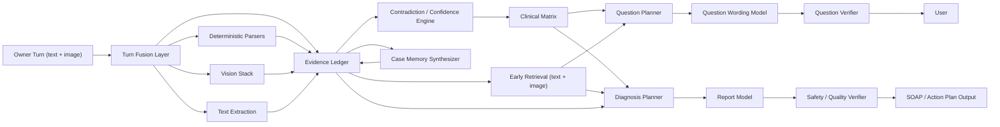

# PawVital Symptom Checker: World-Class Enhancement Plan

## Scope

This plan is grounded in the current codebase:

- `src/app/api/ai/symptom-chat/route.ts`
- `src/lib/nvidia-models.ts`
- `src/lib/triage-engine.ts`
- `src/lib/clinical-matrix.ts`
- `src/lib/minimax.ts`
- `src/lib/symptom-memory.ts`

It extends the current architecture rather than replacing it.

## Current State

The app already has a strong base:

- deterministic clinical matrix controls medical logic
- structured case memory exists
- mixed text + image turns are supported
- NVIDIA multi-model stack is wired
- MiniMax is available for case compression
- final report uses retrieval from text and reference image corpora

The current limitations are architectural, not just model-quality issues.

## Highest-Leverage Gaps

### 1. No evidence ledger between stages

The route moves data through extraction, vision, matrix, phrasing, and reporting, but there is no durable typed "evidence ledger" that records:

- source of fact: owner text, deterministic parser, vision, retrieval, matrix
- confidence
- timestamp / turn index
- contradiction status
- whether a fact is confirmed, provisional, or rejected

Impact:

- hard to debug wrong conclusions
- hard to prevent stale or conflicting facts from leaking downstream
- hard to audit why a question or report was produced

### 2. Retrieval is too late in the loop

Knowledge and reference-image retrieval are mostly used at report time. The question-selection loop itself is still driven mainly by:

- owner text
- matrix
- live image analysis

Impact:

- follow-up questions are less grounded than they could be
- the model cannot use trusted corpus evidence early to disambiguate cases

### 3. Image analysis is classification-heavy, not lesion-centric

The vision stack is good, but it still behaves like "triage + labels + severity" more than a dermatology or wound workup.

Missing:

- lesion morphology normalization
- body-region ontology
- left/right + cranial/caudal + dorsal/ventral mapping
- multi-image comparison
- crop-based reinspection of suspected lesion regions

### 4. No explicit uncertainty model

The system escalates on red flags, but it does not yet compute a consistent uncertainty state across:

- extraction certainty
- vision certainty
- retrieval quality
- matrix ambiguity
- report confidence

Impact:

- the assistant can sound too confident in underdetermined cases
- low-quality image or sparse-history cases are not explicitly downgraded

### 5. No gold-standard evaluation harness

There are tests and scenario regressions, but not a proper clinical benchmark with scored outcomes.

Missing:

- benchmark case set
- expected urgency labels
- expected next-question IDs
- expected missing-data detection
- photo-aware regression bank
- retrieval relevance scoring

Without this, quality work remains anecdotal.

### 6. Dataset governance is incomplete

The repo already uses a lot of image and text corpora, but there is no central dataset registry that tracks:

- source
- license
- species purity
- label schema
- split health
- whether the dataset is safe for production retrieval, training, or only offline eval

Impact:

- mixed cat/dog or noisy labels can pollute retrieval
- commercial-use risk is harder to manage

### 7. No outcome-feedback loop yet

The current app does not close the loop between triage output and eventual real-world veterinary outcome.

Missing:

- confirmed diagnosis capture
- outcome severity
- treatment outcome
- disagreement analysis between app and vet
- auto-generated hard-negative eval cases

## Architecture Recommendation

Keep the current principle:

- matrix decides medical logic
- models assist with extraction, synthesis, phrasing, and vision

Do not move to an unconstrained "doctor LLM" design.

### Target Architecture



## Recommended New Components

### 1. Evidence Ledger

Add a typed structure such as:

```ts
type EvidenceSource =
  | "owner_text"
  | "deterministic_parser"
  | "vision_fast"
  | "vision_detailed"
  | "vision_deep"
  | "retrieval_text"
  | "retrieval_image"
  | "clinical_matrix";

interface EvidenceFact {
  key: string;
  value: string | boolean | number;
  source: EvidenceSource;
  confidence: number;
  turn: number;
  status: "confirmed" | "provisional" | "rejected";
  note?: string;
}
```

Use this as the source of truth for:

- memory compression input
- question planning input
- final diagnosis context

### 2. Early Retrieval Layer

Add retrieval before question phrasing, not only before report generation.

Use it for:

- retrieving similar documented cases
- retrieving condition-specific follow-up cues
- retrieving image exemplars for wound/skin/eye patterns

This should not override the matrix. It should only enrich the planner.

### 3. Explicit Contradiction Engine

Add a contradiction pass before the matrix:

- left leg vs right leg
- sudden vs gradual
- wound present vs image normal
- no trauma vs recent fall/hit

Each contradiction should:

- mark a fact as provisional
- reduce confidence
- increase need for clarifying questions

### 4. Lesion-Centric Vision Abstraction

Create a normalized lesion object:

```ts
interface LesionDescriptor {
  body_region: string;
  laterality?: "left" | "right" | "midline";
  lesion_type: string;
  surface_change: string[];
  discharge: string[];
  swelling: "none" | "mild" | "moderate" | "severe";
  hair_loss: boolean;
  exposure_of_tissue: boolean;
  confidence: number;
}
```

This is more useful than a flat vision summary string.

### 5. Confidence and Escalation Policy

Create one unified uncertainty score from:

- extraction confidence
- vision confidence
- image quality
- contradiction count
- retrieval agreement
- red-flag state

Use it to control:

- whether to ask a clarifying question
- whether to return a provisional report
- whether to recommend higher urgency because of uncertainty

## Hugging Face Resource Map

These are realistic Hugging Face additions that fit this app.

### Retrieval

#### Embeddings

- `BAAI/bge-m3`
  - role: production text embeddings
  - license: MIT
  - use: multilingual/robust retrieval for vet documents and owner text
  - link: <https://hf.co/BAAI/bge-m3>

- `Qwen/Qwen3-Embedding-8B`
  - role: higher-capacity retrieval benchmark candidate
  - license: Apache-2.0
  - use: compare against `bge-m3` for symptom-note and case-memory retrieval
  - link: <https://hf.co/Qwen/Qwen3-Embedding-8B>

#### Rerankers

- `BAAI/bge-reranker-v2-m3`
  - role: production reranker
  - license: Apache-2.0
  - use: rerank retrieved knowledge chunks before report generation
  - link: <https://hf.co/BAAI/bge-reranker-v2-m3>

- `Qwen/Qwen3-Reranker-8B`
  - role: quality benchmark candidate
  - license: Apache-2.0
  - use: stronger but heavier reranking for critical cases
  - link: <https://hf.co/Qwen/Qwen3-Reranker-8B>

### Image Understanding

- `microsoft/BiomedCLIP-PubMedBERT_256-vit_base_patch16_224`
  - role: image-text similarity and reference-image retrieval
  - license: MIT
  - use: compare owner-submitted wound/skin photos against curated exemplar sets
  - caveat: biomedical, not veterinary-specific; best used for retrieval and similarity, not final diagnosis
  - link: <https://hf.co/microsoft/BiomedCLIP-PubMedBERT_256-vit_base_patch16_224>

- `microsoft/Phi-3.5-vision-instruct`
  - role: optional external multimodal fallback / offline benchmark
  - license: MIT
  - use: compare against NVIDIA vision stack for complex mixed text+image turns
  - caveat: not veterinary-specialized; should be benchmarked before production use
  - link: <https://hf.co/microsoft/Phi-3.5-vision-instruct>

### Document Parsing

- `docling-project/SmolDocling-256M-preview`
  - role: PDF and scanned document parsing
  - license: CDLA-Permissive-2.0
  - use: ingest vet PDFs, charts, tables, and scanned references into structured text
  - link: <https://hf.co/docling-project/SmolDocling-256M-preview>

- `HuggingFaceTB/SmolVLM-Instruct`
  - role: lightweight multimodal parsing / VQA benchmark
  - license: Apache-2.0
  - use: optional fallback for low-cost doc and image QA tasks
  - link: <https://hf.co/HuggingFaceTB/SmolVLM-Instruct>

### Models To Avoid As Core Production Brains

- gated or unclear-license models for production-critical paths
- generic medical models without veterinary validation as final diagnostic authority
- any model that bypasses the deterministic matrix

## Missing Ideas Relative To The Existing Enhancement Proposal

The prior proposal appears to focus on model upgrades and feature additions. These are the missing high-value pieces:

### 1. Formal evaluation system

You need a repeatable scoreboard:

- next question accuracy
- urgency accuracy
- contradiction detection accuracy
- photo-grounding accuracy
- report factuality
- red-flag recall
- latency and cost

### 2. Dataset registry

Add a machine-readable registry such as `corpus/datasets.json`:

- `id`
- `source_url`
- `license`
- `species`
- `label_schema`
- `use_for_retrieval`
- `use_for_training`
- `notes`

### 3. Clinical evidence provenance

Every fact in the report should be traceable to:

- owner statement
- image finding
- retrieved document
- matrix rule

### 4. Image-region workflow

For wounds and dermatology, add:

- crop suggestion
- auto-generated lesion caption
- multi-crop comparison
- longitudinal comparison if the owner uploads multiple photos over time

### 5. Outcome-based hard negative generation

When the app and a later vet outcome disagree, automatically create:

- a replay case
- an eval fixture
- a targeted regression

## Priority Roadmap

### Phase 1: Quality Infrastructure

Build first:

1. evidence ledger
2. evaluation harness
3. dataset registry
4. contradiction engine

Without this, future model changes are hard to trust.

### Phase 2: Retrieval Upgrade

Build next:

1. replace current retrieval baseline with embedding + reranker stack
2. use retrieval earlier in question planning
3. add reference-image similarity search

### Phase 3: Vision Upgrade

Build next:

1. lesion descriptor schema
2. region normalization
3. multi-image comparison
4. breed-risk-aware image reasoning

### Phase 4: Reporting Upgrade

Build next:

1. diagnosis planner object
2. SOAP-format output
3. provenance-backed recommendations
4. uncertainty-aware wording

### Phase 5: Learning Loop

Build last:

1. outcome capture
2. disagreement analysis
3. auto-generated eval cases
4. periodic model and retrieval re-benchmarking

## Resource Requests

To make this system materially better, the next resources worth sourcing are:

1. Vet-reviewed benchmark cases
   - at least 200 mixed cases
   - expected urgency
   - expected next question
   - expected differential shortlist

2. Clean species-separated image sets
   - dog-only wound
   - dog-only dermatology
   - dog-only eye and ear
   - laterality / body region labels

3. Outcome labels
   - final vet diagnosis
   - whether surgery, hospitalization, or home care was needed

4. Trusted PDF corpus
   - dermatology
   - wound management
   - orthopedics / lameness
   - GI emergencies
   - toxicology

## Recommended Immediate Next Build

If implementing this in order, the next concrete deliverable should be:

1. add `EvidenceFact[]` ledger to session state
2. add a retrieval reranker stage
3. introduce a lesion descriptor object for vision
4. create an eval pack under `tests/fixtures/triage-evals/`
5. add a benchmark runner that scores:
   - question selection
   - urgency
   - report fidelity
   - photo-grounding

That will improve quality more than swapping one more model in isolation.
