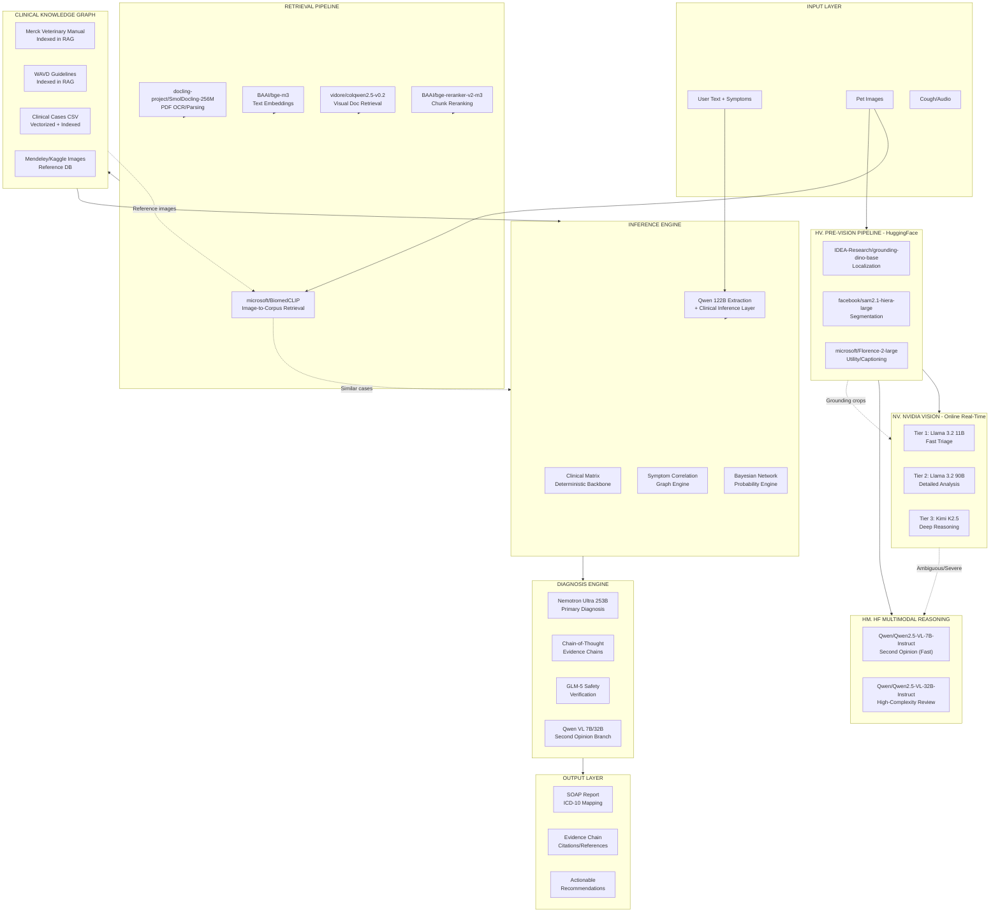

# Veterinary Symptom Analyzer - World-Class Architecture
## Target: 95% Diagnosis Confidence with Full Evidence Chains

---

## Architecture Overview



---

## Service Boundaries & Model Assignment

| Service | Model | Role | Latency Budget |
|---------|-------|------|----------------|
| **Localization** | `grounding-dino-base` | Find wound/body regions | <500ms |
| **Segmentation** | `sam2.1-hiera-large` | Isolate lesion area | <800ms |
| **Utility Vision** | `Florence-2-large` | OCR, captioning, grounding | <600ms |
| **Fast Vision (Tier 1)** | `Llama 3.2 11B` (NVIDIA) | Quick triage + wound detection | <1s |
| **Detailed Vision (Tier 2)** | `Llama 3.2 90B` (NVIDIA) | Feature extraction | <2s |
| **Deep Vision (Tier 3)** | `Kimi K2.5` (NVIDIA) | Complex reasoning | <3s |
| **Multimodal Second Opinion** | `Qwen2.5-VL-7B` (HF) | Ambiguous case review | <2s |
| **High-Complexity Review** | `Qwen2.5-VL-32B` (HF) | Severe/uncertain cases | <5s |
| **Image Retrieval** | `BiomedCLIP` (HF) | Find similar corpus images | <1s |
| **Text Embeddings** | `bge-m3` (HF) | Document/chunk embeddings | <200ms |
| **Reranking** | `bge-reranker-v2-m3` (HF) | Rank retrieved chunks | <300ms |
| **PDF OCR** | `SmolDocling-256M` (HF) | Parse scanned docs | <2s |
| **Visual Doc Retrieval** | `colqwen2.5-v0.2` (HF) | Image-page retrieval | <1s |
| **Extraction** | `Qwen 122B` (NVIDIA) | Structured data extraction | <1s |
| **Diagnosis** | `Nemotron Ultra 253B` (NVIDIA) | Primary diagnosis | <3s |
| **Safety** | `GLM-5` (NVIDIA) | Safety verification | <1s |

---

## Conversation Reliability Hardening (Shipped Through VET-710)

### Shipped Architecture Summary

The following safeguards are now in production as of VET-710:

| Ticket | Safeguard | Status |
|--------|-----------|--------|
| VET-705A | Telemetry hot-path wired; compression switched to narrative-only snapshot | Shipped |
| VET-706 | Telemetry explicitly excluded from compression prompts | Shipped |
| VET-707 | Loop diagnostics with narrow reason codes | Shipped |
| VET-707B | Repeating-question root-cause fix (3-part) | Shipped |
| VET-707C | Chain-of-thought memory improvement with explicit Q&A summaries | Shipped |
| VET-709 | Expanded pending-recovery families for natural phrasing | Shipped |
| VET-710 | Multi-turn replay harness with compression-boundary regressions | Shipped |

### Confirmed Root Causes Behind Repeat-Question Loops (VET-707B)

The repeating-question bug had three distinct root causes that were all addressed in VET-707B:

1. **Faulty guard in `coerceFallbackAnswerForPendingQuestion` (line ~3049)**:
   The pending-question fallback had a logic error where it would skip coercion for certain question types even when a clear answer was present. The guard was too restrictive and allowed natural-language replies to fall through without being recorded.

2. **Smart-quote regex mismatch in `isShortNegativeResponse`**:
   The regex for detecting negative responses like "no" or "not really" did not normalize curly apostrophes (`'` / `'`) to straight apostrophes (`'`). User inputs like "nope" or "it isn't" with smart quotes were not being recognized as negative answers.

3. **Missing intent text normalization**:
   There was no centralized normalization function to handle smart quotes, extra punctuation, and whitespace variations. This caused identical semantic replies to be handled differently depending on the user's keyboard or autocorrect behavior.

**Fix Applied:**
- Added `normalizeIntentText()` function that normalizes smart quotes, removes trailing punctuation, and collapses whitespace
- Updated `isShortNegativeResponse()`, `isShortAffirmativeResponse()`, and `isShortUnknownResponse()` to use normalized text
- Fixed the `coerceFallbackAnswerForPendingQuestion` guard to properly handle all question types
- Added deterministic coercion for water-intake patterns like "yes, he's drinking normally", "not really", and "no not really"

### Confirmed Root Causes Behind Memory/Compression Issues (VET-705A, VET-706, VET-707C)

1. **Compression was receiving too much control state**:
   MiniMax was being sent `answered_questions`, `extracted_answers`, and `unresolved_question_ids` in the prompt, which could lead to the model inadvertently rewriting or hallucinating about conversation control state.

   **Fix:** `buildNarrativeSnapshot()` now excludes protected control state fields. Only narrative context (facts, symptoms, findings, timeline) is sent for summarization.

2. **Protected state was not explicitly preserved during merge**:
   The compression merge function did not explicitly preserve protected fields, relying on the prompt to not include them.

   **Fix:** `mergeCompressionResult()` now explicitly preserves `answered_questions`, `extracted_answers`, `last_question_asked`, and `unresolved_question_ids` from the pre-compression state.

3. **Telemetry was polluting compression prompts**:
   VET-705 internal telemetry entries (extraction, pending_recovery, compression, repeat_suppression) were being included in the service observations sent to MiniMax.

   **Fix:** VET-706 added filtering to exclude telemetry event types from the compression prompt.

4. **Acknowledgments were not referencing confirmed facts**:
   Acknowledgments were based only on `known_symptoms[0]` instead of the actual `case_memory` state.

   **Fix:** VET-707C added `buildConfirmedQASummary()` and `humanizeAnswerValue()` to provide explicit Q&A pairs in phrasing prompts and make acknowledgments reference real confirmed facts.

### Confirmed Root Causes Behind Pending-Recovery Gaps (VET-709)

1. **Natural trauma-history and duration replies were not being recovered**:
   Users responding with phrases like "he's been limping since yesterday" or "he hit his leg on the fence" were not having those answers recorded when extraction failed.

2. **Breathing-onset and stool-consistency coercions had false positives**:
   Some coercions were too aggressive and would close the wrong pending question for unrelated text (e.g., "drinking water" closing a stool question).

3. **Affirmative swelling and unknown-style replies were not handled**:
   Phrases like "yes, there's swelling" or "I'm not sure" were not being deterministically coerced.

   **Fix:** VET-709 expanded the `deriveDeterministicAnswerForQuestion` switch cases and tightened the `coerceFallbackAnswerForPendingQuestion` logic to preserve watery-stool recovery for common owner phrasing while preventing unrelated text from closing the wrong question.

### Shipped Safeguards Summary

**Protected Control State (VET-704, VET-705A, VET-706):**
- `answered_questions`, `extracted_answers`, `unresolved_question_ids`, and `last_question_asked` are now explicitly protected
- Compression operates only on narrative context
- Protected state is preserved losslessly across compression boundaries

**Deterministic Answer Coercion (VET-707B, VET-709):**
- `normalizeIntentText()` handles smart quotes and punctuation variations
- `isShortAffirmativeResponse()`, `isShortNegativeResponse()`, `isShortUnknownResponse()` use normalized text
- Water-intake patterns like "drinking normally", "not really", "no not really" are deterministically coerced
- Trauma-history, duration, swelling, and breathing-onset have expanded recovery patterns

**Observability and Testing (VET-707, VET-710):**
- Loop-detection telemetry records reason codes (extraction_null, pending_recovery_null, repeat_attempt)
- Multi-turn replay harness simulates 5+ turns with realistic owner follow-up language
- Compression-boundary regressions prove protected state survives summarization
- Payload-safety assertions ensure telemetry markers do not leak into user-facing payloads

### Remaining Follow-On Work

1. **Explicit conversation state machine**:
   Replace the ad-hoc pending-question flow with an explicit state machine where questions move through `asked -> answered_this_turn -> confirmed -> needs_clarification`.

2. **Expand deterministic test coverage**:
   Add more direct tests for edge-case replies like "I don't know", "maybe", "for about two days", and multi-sentence responses.

3. **Production telemetry analysis**:
   Use shadow telemetry to track extraction success rate, pending-question rescues, and repeated-question attempts in production to guide further hardening.

---

## Implementation Phases

### Phase 1: Pre-Vision Pipeline (Ground + Segment) ⚡ PRIORITY 1
**Goal:** Isolate the relevant region BEFORE sending to expensive VLMs

#### Step 1.1: Grounding DINO Integration
```typescript
// src/lib/huggingface/grounding.ts
import { HfInference } from "@huggingface/inference";

const grounding = new HfInference(process.env.HF_API_KEY);

interface GroundingResult {
  boxes: { x: number; y: number; width: number; height: number }[];
  labels: string[];
  scores: number[];
}

export async function groundImage(
  imageBase64: string,
  targets: string[] = ["wound", "rash", "lesion", "skin", "paw", "eye", "ear"]
): Promise<GroundingResult> {
  // Grounding DINO takes base64 image + text prompts
  // Returns bounding boxes for each target phrase
  
  const result = await grounding.groundedSemanticSegmentation({
    model: "IDEA-Research/grounding-dino-base",
    inputs: {
      image: imageBase64,
      target_classes: targets.join(", "),
    }
  });
  
  return {
    boxes: result.boxes,
    labels: result.labels,
    scores: result.scores
  };
}
```

#### Step 1.2: SAM2 Segmentation
```typescript
// src/lib/huggingface/sam2.ts
export async function segmentRegion(
  imageBase64: string,
  box: { x: number; y: number; width: number; height: number }
): Promise<string> {
  // SAM2 takes image + box prompt
  // Returns binary mask as base64
  
  const mask = await sam2.predict({
    model: "facebook/sam2.1-hiera-large",
    inputs: {
      image: imageBase64,
      boxes: [box]
    }
  });
  
  // Apply mask to get cropped region
  return applyMaskToImage(imageBase64, mask);
}
```

#### Step 1.3: Crop + Send to Vision Pipeline
```typescript
// Pre-vision pipeline in symptom-chat/route.ts
async function preprocessImage(imageBase64: string) {
  // 1. Ground to find wound regions
  const grounded = await groundImage(imageBase64);
  
  if (grounded.boxes.length > 0) {
    // 2. Segment the highest-scoring region
    const cropped = await segmentRegion(imageBase64, grounded.boxes[0]);
    
    // 3. Get Florence caption for context
    const caption = await florenceCaption(cropped);
    
    return { cropped, caption, grounding: grounded };
  }
  
  return { cropped: imageBase64, caption: null, grounding: null };
}
```

**Files to create/modify:**
- `src/lib/huggingface/grounding.ts` (new)
- `src/lib/huggingface/sam2.ts` (new)
- `src/lib/huggingface/florence.ts` (new)
- `src/app/api/ai/symptom-chat/route.ts` (modify image preprocessing)

---

### Phase 2: RAG Enhancement ⚡ PRIORITY 2
**Goal:** Better retrieval = better diagnosis context

#### Step 2.1: BGE-M3 Embeddings
```typescript
// src/lib/embedding-models.ts (replace/augment)
import { HfInference } from "@huggingface/inference";

const hf = new HfInference(process.env.HF_API_KEY);

export async function embedWithBGE(texts: string[]): Promise<number[][]> {
  const result = await hf.featureExtraction({
    model: "BAAI/bge-m3",
    inputs: texts,
  });
  return result as number[][];
}

export async function embedImagesWithBiomedCLIP(images: string[]): Promise<number[][]> {
  const result = await hf.featureExtraction({
    model: "microsoft/BiomedCLIP-PubMedBERT_256-vit_base_patch16_224",
    inputs: images,
  });
  return result as number[][];
}
```

#### Step 2.2: Reranking Pipeline
```typescript
// src/lib/knowledge-retrieval.ts (enhance)
export async function retrieveAndRerank(
  query: string,
  initialResults: KnowledgeChunkMatch[],
  topK: number = 10
): Promise<KnowledgeChunkMatch[]> {
  // 1. Get initial results from vector search (existing)
  
  // 2. Rerank with BGE-reranker
  const rerankInputs = [
    query,
    ...initialResults.map(r => r.textContent)
  ];
  
  const rerankScores = await hf.textClassification({
    model: "BAAI/bge-reranker-v2-m3",
    inputs: {
      source: query,
      texts: rerankInputs.slice(1)
    }
  });
  
  // 3. Sort by rerank score
  const reranked = initialResults
    .map((r, i) => ({ ...r, rerankScore: rerankScores[i]?.score ?? 0 }))
    .sort((a, b) => b.rerankScore - a.rerankScore)
    .slice(0, topK);
  
  return reranked;
}
```

#### Step 2.3: BiomedCLIP Image Retrieval
```typescript
// src/lib/huggingface/biomedclip.ts
export async function findSimilarReferenceImages(
  queryImageBase64: string,
  conditionLabel: string,
  topK: number = 5
): Promise<ReferenceImageMatch[]> {
  // 1. Embed the query image
  const queryEmbedding = await embedImagesWithBiomedCLIP([queryImageBase64]);
  
  // 2. Query Supabase for reference images with same label
  const candidates = await supabase
    .from("reference_image_assets")
    .select("*")
    .eq("condition_label", conditionLabel)
    .limit(50);
  
  // 3. Score each with BiomedCLIP
  const scored = await Promise.all(
    candidates.data?.map(async (img) => {
      const candidateEmbedding = await embedImagesWithBiomedCLIP([img.local_path]);
      const similarity = cosineSimilarity(queryEmbedding[0], candidateEmbedding[0]);
      return { ...img, similarity };
    }) ?? []
  );
  
  return scored
    .sort((a, b) => b.similarity - a.similarity)
    .slice(0, topK);
}
```

**Files to create/modify:**
- `src/lib/huggingface/biomedclip.ts` (new)
- `src/lib/huggingface/embeddings.ts` (new)
- `src/lib/embedding-models.ts` (modify)
- `src/lib/knowledge-retrieval.ts` (modify)

---

### Phase 3: Multimodal Second Opinion ⚡ PRIORITY 3
**Goal:** Qwen VL as safety net for ambiguous/severe cases

#### Step 3.1: Qwen VL 7B Second Opinion
```typescript
// src/lib/huggingface/qwen-vl.ts
export async function qwenSecondOpinion(
  imageBase64: string,
  context: {
    ownerText: string;
    extractedSymptoms: string[];
    breed: string;
    age: string;
    knownFindings: string[];
  }
): Promise<SecondOpinionResult> {
  const prompt = `You are a veterinary dermatologist providing a second opinion on a pet skin condition.
  
Owner description: ${context.ownerText}
Extracted symptoms: ${context.extractedSymptoms.join(", ")}
Pet breed: ${context.breed}
Pet age: ${context.age}
Prior findings: ${context.knownFindings.join(", ")}

Analyze the image and provide:
1. Primary observation (what you see)
2. Consistency check (does image match owner description?)
3. Additional findings (what might be missed?)
4. Confidence (how certain are you? 0-100)
5. Severity (normal/moderate/severe/emergency)

Format your response as JSON.`;

  const result = await hf.textGeneration({
    model: "Qwen/Qwen2.5-VL-7B-Instruct",
    inputs: {
      image: imageBase64,
      text: prompt,
    },
    parameters: {
      max_new_tokens: 512,
      temperature: 0.3,
    }
  });

  return JSON.parse(result);
}
```

#### Step 3.2: Qwen VL 32B for Complex Cases
```typescript
// Only invoked when:
// - Tier 3 (Kimi) returns "uncertain" 
// - Severity is "urgent"
// - Image/text mismatch detected
export async function qwenComplexReview(
  imageBase64: string,
  context: ClinicalContext,
  referenceImages: ReferenceImageMatch[]
): Promise<ComplexReviewResult> {
  // Include reference images in context
  const prompt = buildComplexReviewPrompt(context, referenceImages);
  
  const result = await hf.textGeneration({
    model: "Qwen/Qwen2.5-VL-32B-Instruct",
    inputs: {
      image: imageBase64,
      text: prompt,
    },
    parameters: {
      max_new_tokens: 1024,
      temperature: 0.2,
    }
  });

  return JSON.parse(result);
}
```

**Files to create/modify:**
- `src/lib/huggingface/qwen-vl.ts` (new)
- `src/app/api/ai/symptom-chat/route.ts` (modify diagnosis flow)

---

### Phase 4: PDF Ingestion Pipeline ⚡ PRIORITY 4
**Goal:** Add your existing veterinary documents to RAG properly

#### Step 4.1: SmolDocling OCR
```typescript
// src/lib/huggingface/smoldocling.ts
export async function parsePDFWithSmolDocling(
  pdfBuffer: Buffer
): Promise<{ text: string; images: string[]; tables: string[] }> {
  const result = await hf.documentQuestionAnswering({
    model: "docling-project/SmolDocling-256M-preview",
    inputs: {
      document: pdfBuffer,
      question: "Extract all text content, tables, and images from this veterinary document."
    }
  });

  return {
    text: result.text,
    images: result.images ?? [],
    tables: result.tables ?? []
  };
}
```

#### Step 4.2: ColQwen2.5 Visual Retrieval
```typescript
// For scanned/image-heavy PDFs
export async function retrieveVisualPages(
  query: string,
  pdfImages: string[]
): Promise<{ pageIndex: number; score: number }[]> {
  const scores = await hf.documentQuestionAnswering({
    model: "vidore/colqwen2.5-v0.2",
    inputs: {
      document: pdfImages,
      question: query
    }
  });

  return scores.map((s, i) => ({ pageIndex: i, score: s.score }));
}
```

**Files to create/modify:**
- `src/lib/huggingface/smoldocling.ts` (new)
- `scripts/ingest-veterinary-docs.ts` (new)

---

### Phase 5: Evidence Chain & Confidence ⚡ PRIORITY 5
**Goal:** 95% confidence with full audit trail

#### Step 5.1: Structured Evidence Chain
```typescript
// src/lib/diagnosis/evidence-chain.ts
interface EvidenceLink {
  source: "vision" | "rag" | "extraction" | "breed" | "roboflow" | "qwen_second_opinion";
  content: string;
  citation?: string;
  confidence: number;
  relevance: number;  // 0-1 how relevant to diagnosis
}

interface DiagnosisEvidence {
  condition: string;
  probability: number;
  evidence_chain: EvidenceLink[];
  supporting_references: Citation[];
  contradicting_evidence: EvidenceLink[];
  recommended_tests: string[];
  confidence_interval: { lower: number; upper: number };
}

export function buildEvidenceChain(
  extractedData: ExtractedData,
  ragResults: KnowledgeChunkMatch[],
  visionResults: VisionResult,
  qwenSecondOpinion: SecondOpinionResult | null,
  breedProfile: BreedProfile
): DiagnosisEvidence[] {
  // For each candidate condition:
  // 1. Find all evidence supporting it
  // 2. Find all evidence contradicting it
  // 3. Weight by source reliability
  // 4. Calculate confidence interval
  
  const evidence: DiagnosisEvidence[] = [];
  
  for (const condition of candidateConditions) {
    const supporting = [];
    const contradicting = [];
    
    // Vision evidence
    if (visionResults.findings.includes(condition)) {
      supporting.push({
        source: "vision",
        content: visionResults.description,
        confidence: visionResults.confidence,
        relevance: 0.9
      });
    }
    
    // RAG evidence
    const ragSupport = ragResults.filter(r => 
      r.textContent.includes(condition)
    );
    supporting.push(...ragSupport.map(r => ({
      source: "rag" as const,
      content: r.textContent.substring(0, 200),
      citation: r.citation,
      confidence: r.score,
      relevance: 0.7
    })));
    
    // Breed evidence
    if (breedProfile.risks.includes(condition)) {
      supporting.push({
        source: "breed",
        content: `${breedProfile.breed} has elevated risk`,
        confidence: 0.95,
        relevance: 0.8
      });
    }
    
    // Qwen second opinion
    if (qwenSecondOpinion?.supporting_conditions?.includes(condition)) {
      supporting.push({
        source: "qwen_second_opinion",
        content: qwenSecondOpinion.reasoning,
        confidence: qwenSecondOpinion.confidence / 100,
        relevance: 0.6
      });
    }
    
    // Calculate weighted probability
    const totalWeight = supporting.reduce((sum, e) => sum + e.confidence * e.relevance, 0);
    const probability = totalWeight / (totalWeight + contradicting.reduce((sum, e) => sum + e.confidence * e.relevance, 0) + 0.01);
    
    evidence.push({
      condition,
      probability,
      evidence_chain: supporting,
      supporting_references: supporting.filter(e => e.citation).map(e => ({ citation: e.citation })),
      contradicting_evidence: contradicting,
      recommended_tests: getRecommendedTests(condition),
      confidence_interval: calculateConfidenceInterval(supporting, contradicting)
    });
  }
  
  return evidence.sort((a, b) => b.probability - a.probability);
}
```

#### Step 5.2: Confidence Calibration
```typescript
// Target: 95% confidence means 95% of predictions are correct
interface CalibratedConfidence {
  raw: number;      // Model's internal confidence
  calibrated: number; // Calibrated to match real-world accuracy
  n_samples: number;  // How many similar cases seen
}

export function calibrateConfidence(
  rawConfidence: number,
  evidenceChain: EvidenceLink[]
): CalibratedConfidence {
  // Base calibration on evidence strength
  const avgEvidenceStrength = evidenceChain.reduce(
    (sum, e) => sum + e.confidence * e.relevance, 0
  ) / evidenceChain.length;
  
  // Adjust based on number of evidence sources
  const sourceDiversity = new Set(evidenceChain.map(e => e.source)).size;
  const diversityBonus = Math.min(sourceDiversity * 0.02, 0.1);
  
  // Adjust based on consistency (Qwen second opinion agrees?)
  const hasSecondOpinion = evidenceChain.some(e => e.source === "qwen_second_opinion");
  const secondOpinionBonus = hasSecondOpinion ? 0.05 : 0;
  
  const calibrated = Math.min(
    avgEvidenceStrength + diversityBonus + secondOpinionBonus,
    0.98  // Never claim 100%
  );
  
  return {
    raw: rawConfidence,
    calibrated: Math.round(calibrated * 100) / 100,
    n_samples: evidenceChain.length
  };
}
```

**Files to create/modify:**
- `src/lib/diagnosis/evidence-chain.ts` (new)
- `src/lib/diagnosis/confidence.ts` (new)
- `src/app/api/ai/symptom-chat/route.ts` (modify diagnosis output)

---

## Concrete Implementation Order

### Week 1-2: Pre-Vision Pipeline
| # | Task | Files | Dependency |
|---|------|-------|------------|
| 1 | Set up HuggingFace client | `src/lib/huggingface/client.ts` | None |
| 2 | Implement Grounding DINO | `src/lib/huggingface/grounding.ts` | HF client |
| 3 | Implement SAM2 segmentation | `src/lib/huggingface/sam2.ts` | None |
| 4 | Integrate into image preprocessing | `route.ts` | DINO + SAM2 |
| 5 | Add Florence utility calls | `src/lib/huggingface/florence.ts` | HF client |

### Week 3-4: RAG Enhancement
| # | Task | Files | Dependency |
|---|------|-------|------------|
| 1 | Implement BGE-M3 embeddings | `src/lib/huggingface/embeddings.ts` | None |
| 2 | Implement BGE reranker | `src/lib/knowledge-retrieval.ts` | BGE |
| 3 | Implement BiomedCLIP retrieval | `src/lib/huggingface/biomedclip.ts` | Embeddings |
| 4 | Connect reference images to RAG | `route.ts` | BiomedCLIP |
| 5 | Ingest clinical CSV cases | `scripts/ingest-clinical-data.ts` | None |

### Week 5-6: Multimodal Second Opinion
| # | Task | Files | Dependency |
|---|------|-------|------------|
| 1 | Implement Qwen VL 7B client | `src/lib/huggingface/qwen-vl.ts` | HF client |
| 2 | Implement Qwen VL 32B client | `src/lib/huggingface/qwen-vl.ts` | Qwen 7B |
| 3 | Add trigger conditions (ambiguous/severe) | `route.ts` | Qwen VL |
| 4 | Integrate with diagnosis engine | `route.ts` | Qwen VL |

### Week 7-8: Evidence Chains
| # | Task | Files | Dependency |
|---|------|-------|------------|
| 1 | Build evidence chain structure | `src/lib/diagnosis/evidence-chain.ts` | All prior |
| 2 | Implement confidence calibration | `src/lib/diagnosis/confidence.ts` | Evidence chain |
| 3 | Update report format | `route.ts` | Confidence |
| 4 | Add ICD-10 mapping | `src/lib/diagnosis/icd10.ts` | Evidence chain |

### Week 9-10: PDF Pipeline & Integration
| # | Task | Files | Dependency |
|---|------|-------|------------|
| 1 | Implement SmolDocling OCR | `src/lib/huggingface/smoldocling.ts` | HF client |
| 2 | Implement ColQwen2.5 retrieval | `src/lib/huggingface/colqwen.ts` | HF client |
| 3 | Create PDF ingestion script | `scripts/ingest-veterinary-docs.ts` | SmolDocling |
| 4 | Full integration test | All files | All |

---

## API Boundaries (Exact Contract)

### Image Input Contract
```typescript
// Pre-vision output (what goes to NVIDIA vision)
interface PreprocessedImage {
  original: string;           // Original base64
  cropped?: string;           // Cropped to lesion region
  caption?: string;           // Florence caption
  grounding?: {
    labels: string[];
    boxes: number[][];
  };
  samMask?: string;          // Binary mask if needed
}

// Vision output (what goes to diagnosis)
interface VisionAnalysis {
  tier1: { json: string; severity: string; };
  tier2?: { json: string; features: string; };
  tier3?: { reasoning: string; diagnosis: string; };
  qwenSecondOpinion?: {
    primaryObservation: string;
    consistency: "match" | "mismatch" | "partial";
    additionalFindings: string[];
    confidence: number;
  };
  referenceImages?: ReferenceImageMatch[];
}
```

### Diagnosis Input Contract
```typescript
interface DiagnosisInput {
  pet: { breed: string; age: string; weight: string; species: string; };
  symptoms: { explicit: string[]; inferred: string[]; };
  vision: VisionAnalysis;
  ragResults: KnowledgeChunkMatch[];
  evidenceChain: EvidenceLink[];
  context: {
    conversationHistory: string;
    previousDiagnoses: string[];
    urgencyFlags: string[];
  };
}

interface DiagnosisOutput {
  differentials: {
    condition: string;
    probability: number;
    confidence: CalibratedConfidence;
    evidenceChain: EvidenceLink[];
    recommendedTests: string[];
    urgency: "home_care" | "vet_soon" | "vet_24h" | "ER_NOW";
  }[];
  chainOfThought: {
    step: number;
    observation: string;
    inference: string;
    evidence: string[];
  }[];
  safetyFlags: string[];
  report: ClinicalReport;
}
```

---

## Key Files Summary

| Category | File | Purpose |
|----------|------|---------|
| **HF Client** | `src/lib/huggingface/client.ts` | HuggingFace API wrapper |
| **Ground/Segment** | `src/lib/huggingface/grounding.ts` | Grounding DINO integration |
| **Ground/Segment** | `src/lib/huggingface/sam2.ts` | SAM2 segmentation |
| **Utility** | `src/lib/huggingface/florence.ts` | Florence-2 captioning/OCR |
| **Embeddings** | `src/lib/huggingface/embeddings.ts` | BGE-M3 + Nomic |
| **Rerank** | `src/lib/knowledge-retrieval.ts` | BGE reranker |
| **Image Retrieval** | `src/lib/huggingface/biomedclip.ts` | BiomedCLIP corpus search |
| **Multimodal** | `src/lib/huggingface/qwen-vl.ts` | Qwen VL 7B/32B |
| **PDF** | `src/lib/huggingface/smoldocling.ts` | SmolDocling OCR |
| **PDF** | `src/lib/huggingface/colqwen.ts` | ColQwen2.5 visual retrieval |
| **Diagnosis** | `src/lib/diagnosis/evidence-chain.ts` | Evidence linking |
| **Diagnosis** | `src/lib/diagnosis/confidence.ts` | Confidence calibration |
| **Diagnosis** | `src/lib/diagnosis/icd10.ts` | ICD-10 mapping |
| **Ingestion** | `scripts/ingest-clinical-data.ts` | CSV → RAG |
| **Ingestion** | `scripts/ingest-reference-images.ts` | Images → DB |
| **Ingestion** | `scripts/ingest-veterinary-docs.ts` | PDF → RAG |
| **Main** | `src/app/api/ai/symptom-chat/route.ts` | Orchestration |

---

## Environment Variables Required

```bash
# HuggingFace
HF_API_KEY=your_hf_key

# Existing (keep)
NVIDIA_API_KEY=your_nvidia_key
NVIDIA_QWEN_API_KEY=your_qwen_key
NVIDIA_DEEPSEEK_API_KEY=your_deepseek_key
NVIDIA_KIMI_API_KEY=your_kimi_key
NVIDIA_GLM_API_KEY=your_glm_key

# Roboflow (existing)
ROBOFLOW_API_KEY=your_roboflow_key
ROBOFLOW_WORKSPACE_NAME=your_workspace
ROBOFLOW_WORKFLOW_ID=your_workflow

# Nyckel (existing)
NYCKEL_CLIENT_ID=your_nyckel_id
NYCKEL_CLIENT_SECRET=your_nyckel_secret

# API Ninjas (existing)
API_NINJAS_KEY=your_ninjas_key
```

---

## What NOT To Do

1. **Do not let Qwen VL make final triage decisions** - It is a second opinion, not the decider
2. **Do not replace the clinical matrix with LLM suggestions** - Matrix stays as ground truth
3. **Do not use human-medical models as primary** - medgemma stays for benchmarking only
4. **Do not send every image to Qwen VL** - Only ambiguous/severe cases
5. **Do not claim 100% confidence** - Cap at 98%, always show evidence chain

---

## Confidence Targets

| Case Complexity | Primary Model | Second Opinion | Target Confidence |
|----------------|---------------|---------------|------------------|
| Simple (clear symptoms) | Nemotron | None | 90-95% |
| Moderate (some ambiguity) | Nemotron | Qwen 7B | 92-95% |
| Complex (severe/uncertain) | Nemotron | Qwen 32B | 88-93% |
| Image-text mismatch | Nemotron | Qwen 7B + Kimi | 85-90% |
| Emergency (red flags) | Nemotron + immediate alert | Qwen 32B async | 95%+ (trigger ER) |

---

## Implemented Bug Fixes (March 2026)

### Bug: Repeating Question After 2nd User Message

**Symptom:** After the 2nd user message (e.g., "yes it's drinking normally" in response to water_intake question), the AI repeatedly asks the same question instead of progressing.

**Root Causes Identified:**

1. **Fragile LLM JSON extraction**: The Qwen/Claude structured extraction often fails to parse answers correctly, falling back to weak keyword extraction
2. **Pending-question state was not defensive enough**: `last_question_asked` is written before phrasing, but a natural-language reply could still fall through if neither structured extraction nor deterministic coercion turned it into an `answered_questions` update
3. **Weak choice and fallback coercion**: Natural replies such as "yes, he's drinking normally" or short uncertainty replies like "I don't know" were not consistently turned into durable answers
4. **Static acknowledgment phrasing**: Acknowledgments were based only on `known_symptoms[0]` instead of dynamic `case_memory`

**Fixes Applied:**

#### Fix 1: Enhanced water_intake Regex Patterns
**File:** `pawvital-ai/src/app/api/ai/symptom-chat/route.ts` (line ~2984)

```typescript
/\b(drinking normally|water is normal|normal drinking|drinking okay|drinking ok|water seems fine|intake is normal)\b/.test(lower) ||
/yes[^a-z]*[a-z]*[^a-z]*normal/.test(lower) ||
((lower.includes("normal") || lower.includes("fine") || lower.includes("okay") || lower.includes("ok")) &&
  (lower.includes("drink") || lower.includes("water") || lower.includes("yes")))
```

The matcher now handles more natural "normal drinking" phrasing instead of relying on a single narrow regex.

#### Fix 2: Robust Pending-Question Guard
**File:** `pawvital-ai/src/app/api/ai/symptom-chat/route.ts` (line ~637-650)

Added a guarded fallback that only records raw text when the turn still looks like a direct answer to the pending question:

```typescript
const pendingAnswer = resolvePendingQuestionAnswer({
  questionId: pendingQ,
  rawMessage: lastUserMessage.content,
  combinedUserSignal,
  turnAnswers: mergedAnswers,
  turnSymptoms: turnTextSymptoms,
});

if (pendingAnswer !== null) {
  session = recordAnswer(session, pendingQ, pendingAnswer.value);
}
```

This closes direct replies that extraction missed, while still avoiding force-closing an unrelated pending question when the owner raises a new symptom instead.

#### Fix 3: Dynamic Acknowledgments Based on case_memory
**File:** `pawvital-ai/src/app/api/ai/symptom-chat/route.ts` (line ~1200-1222)

```typescript
// BEFORE:
const symptomLead = session.known_symptoms[0];
const acknowledgment = symptomLead
  ? `I'm keeping track of what you've shared so far about ${petName}'s ${symptomLead.replace(/_/g, " ")}.`
  : `Thanks for sharing that about ${petName}.`;

// AFTER:
const memory = ensureStructuredCaseMemory(session);
const chiefComplaint = memory.chief_complaints[0]?.replace(/_/g, " ") || null;
const confirmedFactsCount = Object.keys(memory.confirmed_facts || {}).length;

let acknowledgment: string;
if (hasPhoto && allowPhotoMention) {
  acknowledgment = `Thanks for sharing that about ${petName}; I'm combining your answer with the photo and the rest of the history.`;
} else if (chiefComplaint) {
  acknowledgment = `I'm keeping track of what you've shared so far about ${petName}'s ${chiefComplaint}${confirmedFactsCount > 2 ? `, plus ${confirmedFactsCount - 1} more details` : ""}.`;
} else if (confirmedFactsCount > 0) {
  acknowledgment = `I'm keeping track of the ${confirmedFactsCount} facts you've shared about ${petName}.`;
} else {
  acknowledgment = `Thanks for sharing that about ${petName}.`;
}
```

Now acknowledgments dynamically reflect the actual case memory state, mentioning chief complaints and fact counts.

**Testing Recommendations:**
1. Test "yes it's drinking normally" → should answer water_intake and progress
2. Test "no" → should record as answered and progress
3. Test "I don't know" → should record raw response and not repeat question
4. Verify acknowledgment reflects actual case state after multiple turns
